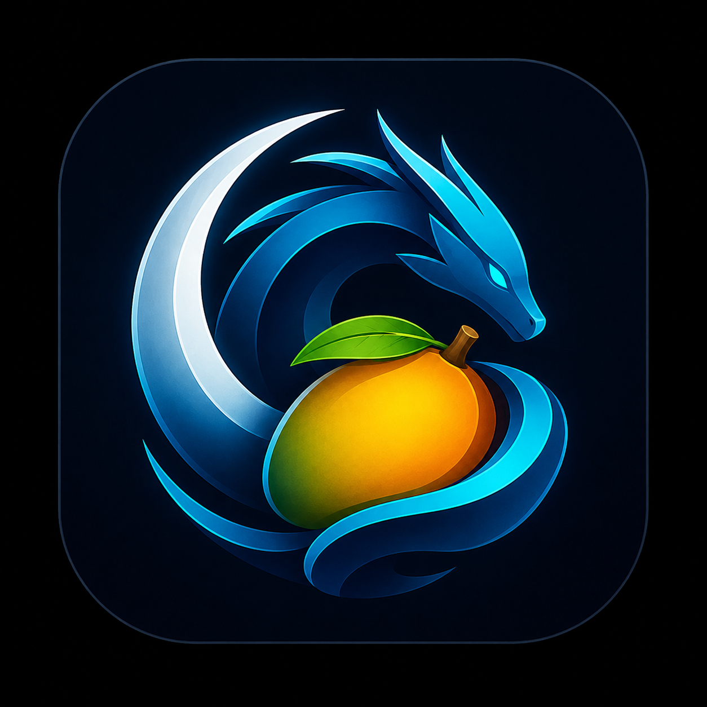
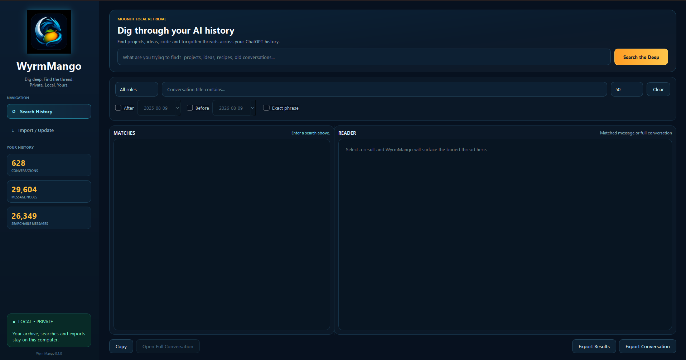

<p align="center">
  
</p>

<h1 align="center">WyrmMango</h1>

<p align="center">
  <strong>Dig deep. Find the thread.</strong><br>
  Private, local-first search and retrieval for your ChatGPT conversation history.
</p>

<p align="center">
  <strong>Version 0.1.0</strong> · Python · SQLite FTS5 · PySide6
</p>

---

## What is WyrmMango?

WyrmMango is a private, local-first desktop application for importing and searching your own ChatGPT conversation history.

Your archive stays on your computer. WyrmMango builds a local SQLite search database so you can rediscover projects, ideas, code, decisions, and forgotten conversations without uploading your history to another service.

## Screenshot

<p align="center">
  
</p>

## Features

- Import an official ChatGPT data export ZIP
- Automatically discover numbered conversation JSON files
- Preserve conversation and message data locally
- SQLite FTS5 full-text search
- Exact phrase search
- Filter by message role, conversation title, and date range
- Read matched messages
- Open complete conversations
- Export search results to Markdown
- Export complete conversations to Markdown
- Re-import updated ChatGPT exports
- Local desktop interface built with PySide6
- Windows desktop shortcut support

## Privacy

WyrmMango is designed around local ownership of personal conversation history.

The public source repository does **not** contain your ChatGPT conversations.

The following are excluded from Git by default:

- ChatGPT export ZIP files
- conversation JSON files
- SQLite databases
- attachments
- local archive directories
- local environment files
- Python virtual environments
- backup files

**Never commit your personal ChatGPT export or generated SQLite database to a public repository.**

## Requirements

- Python 3.10 or newer
- SQLite with FTS5 support
- PySide6

Install the Python dependency with:

```powershell
python -m pip install -r requirements.txt
```

## Running WyrmMango

From the project directory:

```powershell
& ".\.venv\Scripts\python.exe" ".\src\app.py"
```

On Windows, `pythonw.exe` can be used for a desktop shortcut so WyrmMango launches without a console window.

## Project Structure

```text
WyrmMango/
├── assets/
│   ├── wyrmmango_icon.png
│   ├── wyrmmango.ico
│   └── wyrmmango_screenshot.png
├── src/
│   ├── app.py
│   ├── database.py
│   ├── import_chatgpt.py
│   └── search_archive.py
├── README.md
├── ROADMAP.md
├── requirements.txt
└── .gitignore
```

Local user data such as `data/` and `exports/` is intentionally excluded from the public repository.

## Command-Line Search

Basic search:

```powershell
python .\src\search_archive.py "old project"
```

Exact phrase search:

```powershell
python .\src\search_archive.py "model registry" --exact
```

Limit results:

```powershell
python .\src\search_archive.py "Python" --limit 10
```

Filter by message role:

```powershell
python .\src\search_archive.py "SQLite" --role user
```

Filter by date:

```powershell
python .\src\search_archive.py "project" --after 2025-01-01 --before 2026-01-01
```

Show archive statistics:

```powershell
python .\src\search_archive.py --stats
```

## Local Database

The local SQLite archive is deliberately ignored by Git and is not part of the WyrmMango source repository.

## Roadmap

See [`ROADMAP.md`](ROADMAP.md) for planned UI and branding improvements.

## Version

Current application version: **0.1.0**

## License

WyrmMango is licensed under the **GNU General Public License v3.0 (GPL-3.0)**. See [LICENSE](LICENSE).

